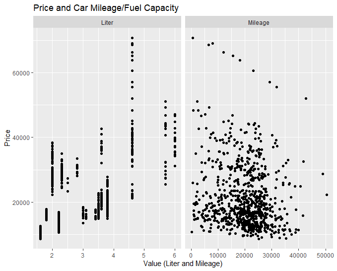
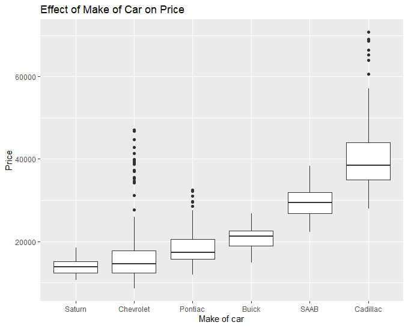
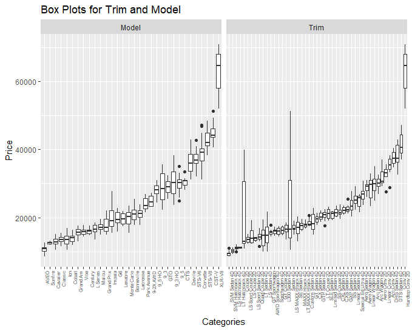
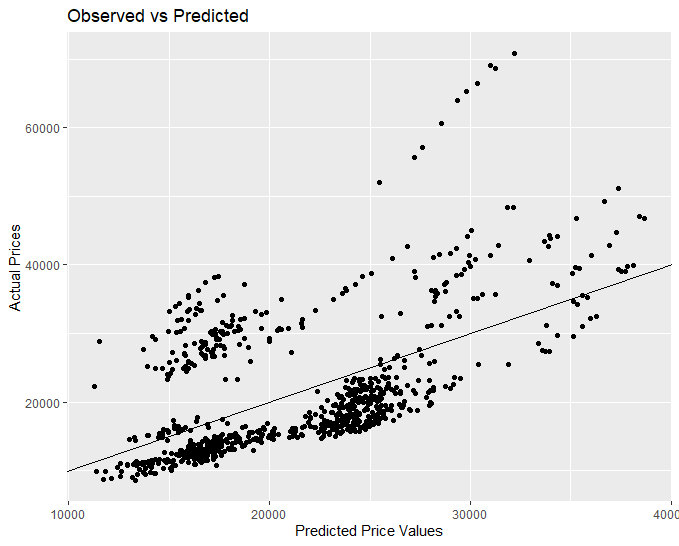
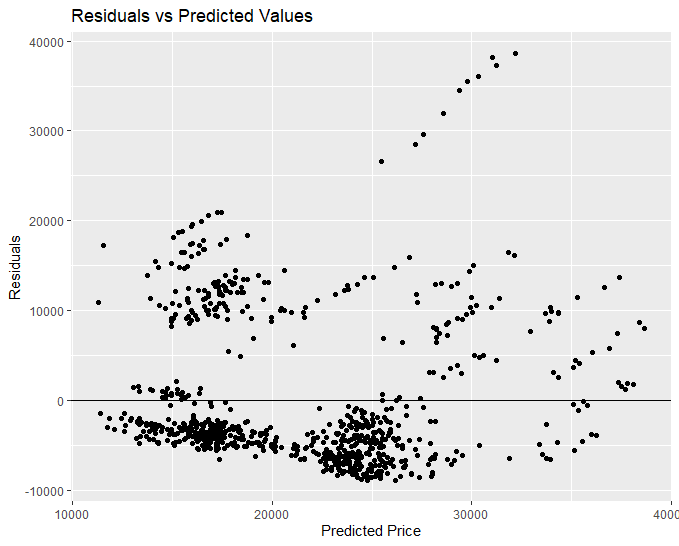

## Project Title: Used Car Price Prediction 

### Project Description

This project focuses on building a predictive model to accurately estimate the retail price of used General Motors (GM) cars. By analyzing a dataset of over eight hundred vehicles, I developed a comprehensive linear model to help potential buyers and sellers better understand the factors influencing a car's market value. The analysis revealed that a combination of continuous and categorical features can predict a car's price with a high degree of accuracy.

#### Business Question

> "What are the key vehicle features and metrics that most significantly impact the retail price of used General Motors (GM) cars in excellent condition?"

### Data Analysis & Methology

* **Data Source:** This project uses a dataset of over eight hundred used GM cars from 2005. The data was originally sourced from the **2005 Central Edition of Kelly Blue Book,** which is highly reputable resource for vehicle evaluation. A key assumption of this analysis is that all cars in the dataset were less than one year old and considered to be in **"excellent condition.**"

* **Dataset Overview:** The dataset includes the following variables:

| Variable | Description |
| -------- | ----------- |
| **Price** | Suggested retail price in excellent condition. |
| **Mileage** | Number of miles the car has been driven. |
| **Make** | Manufacturer of the car (e.g., Saturn, Pontiac, Chevrolet). |
| **Model** | Specific car model (e.g., Ion, Vibe, Cavalier). |
| **Trim** | Specific model variant (e.g., SE Sedan 4D). |
| **Type** | Body type (e.g., sedan, coupe). |
| **Cylinder** | Number of cylinders in the engine. |
| **Liter** | Engine size. |
| **Doors** | Number of doors. |
| **Cruise** | `1` if the car has cruise control, `0` otherwise. |
| **Sound** | `1` if the car has upgraded speakers, `0` otherwise. |
| **Leather** | `1` if the car has leather seats, `0` otherwise. |

* **Data Context:** This dataset represents a specific, curated snapshot of the used car market in 2005. It's crucial to acknowledge the **assumptions and limitations** of this data, specifically that all vehicles were less than one year old and in **"excellent condition.**" Therefore, the findings of this analysis are most relevant to understanding the **pricing of well-maintained, late-model GM vehicles** and may not generalize to older or less-maintained cars. The data also doesn't account for geographical location, which can significantly impact car prices. 

### Key Findings and Results

##### Exloratory Data Analysis (EDA)

Initial exploration of the data revealed that Mileage has a clear inverse relationship with price. As a car's mileage increases, its price generally decreases, a trend that is visually apparent in the scatter plot below.

However, a more significant finding was the strong influence of categorical variables. I've found out that a car's **Make** played a substantial role in determining its price. The box plot below illustrates the notable price differences across various car makes, with some brands like Cadillac consistently holding higher values than others.

While other variables like Trim and Model also showed a strong relationship with price, their large number of unique categories makes them difficult to visualize in a single plot.

#### Model Performance

To quantify these relationships, I compared two linear regression models. The results clearly demonstrated that a model incorporating both continuous and categorical variables significantly outperformed a simpler model.

* **Continuous Model:** This model, using only `Mileage` and `Liter`, had a R-squared value of **0.33**, indicating it could only explain about a third of the variability in car prices. The diagnostic plots for this model showed clear violations of the linearity, homoscedasticity, and normality assumptions, indicating a poor fit.

* **Mixed Model:** By adding categorical variables like `Make`, `Type`, and `Cylinder`, the model's performance dramatically improved. The R-squared value jumped to **0.94**, meaning it can explain over 94% of the variability. Diagnostic plots for this model showed a much better fit, although some minor issues with non-normality in the residuals were still present.

For the first plot, **"Observed vs. Predicted Prices"**, the points are closely clustered around the diagonal line, indicating that the mixed model's predicted prices are highly accurate and closely align with the actual prices.

For the second plot, **"Residuals vs. Predicted Values"**, the residuals are randomly scattered around the horizontal line at `y=0`, with no clear pattern. This suggests that the model's errors are consistent across all predicted price values, satisfying the assumption of **constant variability (homoscedasticity).**

This substantial increase in predictive power proves that a car's Make, Type, and Cylinder are far more influential on its price than mileage alone.

### Conclusion

Overall, the **mixed model** is a major improvement over the simpler continuous model. The R-squared value increased from **33% to 94%**, which provides a more reliable and accurate prediction of car prices. While the mixed model still has minor issues with non-normality in the residuals, particularly at high prices, its vastly superior predictive power makes it the ideal choice for this project. If I were picking a car, I would trust the predictions of the mixed model because it is a more reliable and accurate representation of the market.

### Code and Data:

This project was developed in R, with all analysis contained within the `car_prices.Rmd` file. The primary dataset is `kuiper.xlsx`, a file containing over 800 observations of used GM cars from 2005.

The following R packages are required to run the code: `tidyverse`, `broom`, `modelr`, `readxl`, `plotly`.

### How to Run:

To run this analysis, you will need to have **R** and **RStudio** installed on your machine.

1. **Open the R project:** Open the `used-car-price-prediction.Rproj` file in RStudio. This will set your working directory to the project's root folder and ensure the code runs correctly.

2. **Install R packages:** Install the necessary packages by running the following command in the RStudio console: `install.packages(c("tidyverse", "broom", "modelr", "readxl", "plotly"))`.

3. **Run the analysis:** Open the `car_prices.Rmd` file. Click the **"Knit"**  button to run the code and generate the final report with all the results and visualizations. Alternatively, for a more automated approach, you can open the RStudio **Terminal** and run `make`.

